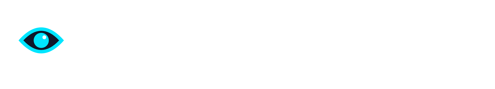

<div align="center">
  <picture>
    <source media="(prefers-color-scheme: dark)" srcset="docs/logo-dark.png">
    <source media="(prefers-color-scheme: light)" srcset="docs/logo-light.png">
    
  </picture>

  <p><strong>Threat Intelligence & SOC Operations Platform</strong></p>

  [](https://github.com/nilsonpmjr/Vantage/actions/workflows/ci.yml)
  [](https://www.python.org/)
  [](https://fastapi.tiangolo.com/)
  [](https://reactjs.org/)
  [](https://www.mongodb.com/)
  [](LICENSE)

  [**Documentation**](https://vantage.readthedocs.io) · [**Quick Start**](#quick-start) · [**Support the project**](#support-the-project)
</div>

---

VANTAGE is a threat intelligence and SOC operations platform for analyst teams. It combines fast multi-source verdicts for IPs, domains, and file hashes with a full operational workspace — feed triage, recon, watchlists, and shift handoff — in a single product.

Released under **AGPLv3**. Open and auditable by design.

## What's included

| Module | Description |
|---|---|
| **Analysis** | Single-target lookup (IP, domain, hash) across all configured sources in parallel; AI verdict summary in PT-BR, EN, and ES |
| **Batch Analysis** | Upload a target list; streamed processing with downloadable report |
| **Feed** | RSS/XML ingestion (NVD CVE, FortiGuard, MISP, custom); editorial scoring; CTI modeling readiness index |
| **Recon** | On-demand and scheduled deep recon scans; per-target history; streamed results |
| **Watchlist** | Persistent monitoring with automatic re-scan and SMTP alert on verdict change |
| **Shift Handoff** | Structured shift-transition forms; per-handoff incident tracking; acknowledgment flow; attachment support; artifact auto-capture from analyze and recon sessions |
| **Dashboard** | Verdict trends by period; top targets; source health |
| **Admin** | Users & roles, security policies, extensions, threat ingestion, SMTP config, system health, audit log |

## Upcoming extension features

These surfaces are outside the public core today and are expected to live as separate extension-backed features.

| **Hunting** | Premium hunting provider lane (native, isolated container, or Kali sidecar) |
| **Exposure** | Premium attack surface and brand exposure monitoring provider lane |

**Security**: Argon2id passwords · TOTP MFA with AES-256 encrypted secrets · JWT + HttpOnly cookies · refresh token rotation · per-session revocation · scoped API keys · configurable lockout and password policy · full audit trail

## Quick Start

> **No default credentials.** The platform blocks all authenticated requests until `setup:create-admin` is run.

```bash
git clone https://github.com/nilsonpmjr/Vantage.git
cd Vantage
cp .env.example .env          # fill in JWT_SECRET, MONGO_PASSWORD, and API keys
docker compose up -d
docker compose exec backend python bin/console setup:create-admin
# Open http://localhost
```

For the full installation guide, environment variables reference, and production deployment notes, see the **[documentation](https://vantage.readthedocs.io)**.

## Licensing & Distribution

- **Core**: AGPLv3 — open, auditable, self-hostable
- **Commercial layer**: support, managed operation, premium extensions, and contract-specific deliverables outside this repository

## Support the project

VANTAGE is built and maintained in the open. If it saves you time, consider supporting its development.

<div align="center">

[](https://buymeacoffee.com/nilsonpmjr)

</div>

Every contribution — no matter the size — helps keep the project moving.
